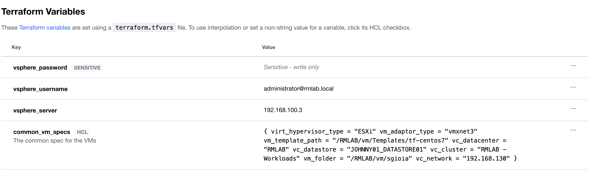
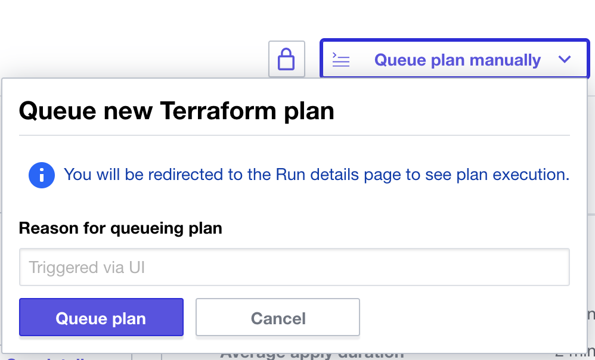
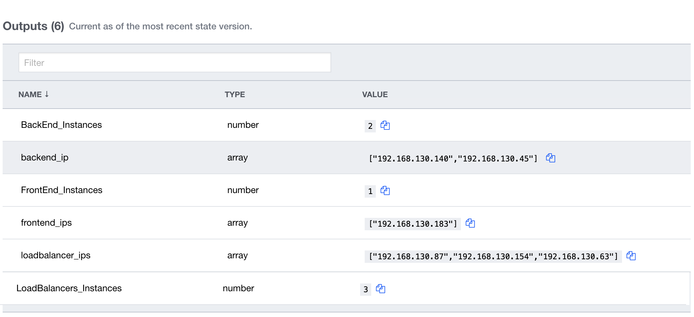

# Deploying Compute Server Resources using Cisco Intersight Service for HashiCorp Terraform

## Overview

Cisco Intersight Service for HashiCorp Terraform (IST) addresses the challenge of securely connecting and configuring on-premises and hybrid environments to work with Terraform Cloud Business Tier. Leveraging Intersight Assist, users can integrate Terraform Cloud Business with Cisco Intersight, enabling secure communication between on-premises data centers and edge locations with the IaC platform. This means users can spend less time managing the end-to-end lifecycle of Terraform Cloud Agents, benefiting from native integration directly within Intersight, including upgrades and the ability to scale as demand grows.

This use case is about creating several virtual servers (VMs) to support creating an environment used in DevOps methodology. An environment like Dev, Test, Pre-Production, and so on. 
Depending on the configuration passed to Terraform, it can dynamically create any number of virtual server in any category you choose. Resources could be host in any private or public cloud, depending on the configuration. 
Cloud supported today are VMware.

In this example, we will create three categories to support the developer team with the creation of resource in a private cloud based on vCenter:
-	Load Balancer VMs ready to host HA proxy such as NGINX
-	FrontEnd VMs ready to host web server like Apache
-	BackEnd VMs to host Database and middleware such as API Gateway, Business Logic, etc.

Imagine a Developer team that needs to create an environment with:
-	2 LoadBalancer
-	2 FrontEnd
-	2 BackEnd 


The team can refer to a standard template to store common configurations, such as datastore, disk size, golden OS image, etc. A sample template looks like the following:
```
common_vm_specs = {
  virt_hypervisor_type = "ESXi"
  vm_adaptor_type      = "vmxnet3"
  vm_template_path     = "/RMLAB/vm/Templates/tf-centos7"
  vc_datacenter        = "RMLAB"
  vc_datastore         = "JOHNNY01_DATASTORE01"
  vc_cluster           = "RMLAB - Workloads"
  vm_folder            = "/RMLAB/vm/sgioia"
  vc_network           = "192.168.130"
}
```
But you can also specify different VM configurations depending on the category (frontend, backend, you name it). You will be using a template to define specific VM setting such as CPU, Memory, Network, etc.

```
vms = {
  frontend = {
    quantity   = 1
    vCPU        = 2
    vMEM        = 4096
    diskSize    = 60 # Will override the spec of the template
    vmname      = "frontend"
    datastore   = "JOHNNY01_DATASTORE01"
    network     = null # Will be used the one in the common_vm_specs
    hostname    = "frontend"
    domain_name = "rmlab.local"
    ssh_key     = ""
  }
  backend = { ...
```

## Requirements

1.	Intersight SaaS platform account with Advantage licenses
2.	An Intersight Assist appliance that is connected to your Intersight environment
3.	Terraform Cloud Business Tier Account
4.	vCenter Server Access: username, password and host
5.	DHCP server to allocate ip addresses dynamically
6.	GitHub account to host your Terraform code
7.	Virtual Machine Template to represent the VMs specifications
8.	Template to represent common values for VMs specification
9.	A workspace in Terraform Cloud 

## Steps to Deploy Use Case

### Setup Terraform Cloud Business Tier Account

To add your Terraform Cloud credentials in Intersight you will need the following:
1. Terraform Cloud Username
2. Terraform Cloud API Token
3. Terraform Cloud Organization

Login to Intersight and claim your Terraform Cloud target.

### Claim Terraform Agent

Once the target is created, the agent can be added assist. 

### Create GitHub Repo

1. Go to https://github.com/CiscoDevNet/ist-cookbook/tree/main/ist-devops-env-sample
2. Fork it into your own GitHub account

### Datacenter Prep

Create a template for a linux VM. This could be either CentOS or Ubuntu. Make sure you have VMware tools pre installed on the VM. We will use this template to a create a VM in the datacenter.

### Create Workspace in Terraform Cloud

Create a workspace in Terraform Cloud. You can do either as manual or automatic process.


#### Automatic Process
If you want you can create automatically a workspace using Terraform. Just use the following module:
https://github.com/CiscoDevNet/ist-cookbook/tree/main/tfc4b_provisioning

If you choose to use the TCF4B_Provisioning, just make sure to pass the right information using map object, like the example below:
```
vars_list = {
  vsphere_server = {
        name = "vsphere_server"
        val = "192.168.100.1"
        sensitive = false
        hcl       = false
    }
    vsphere_username = {
        name = "vsphere_username"
        val = "administrator@domain.local"
        sensitive = false
        hcl       = false
    }
    vsphere_password = {
        name = "vsphere_password"
        val = "password!!!!"
        sensitive = true
        hcl       = false
    }
    common_vm_specs = {
        virt_hypervisor_type = "ESXi"
        vm_adaptor_type      = "vmxnet3"
        vm_template_path     = "/RMLAB/vm/Templates/tf-centos7"
        vc_datacenter        = "RMLAB"
        vc_datastore         = "JOHNNY01_DATASTORE01"
        vc_cluster           = "RMLAB - Workloads"
        vm_folder            = "/RMLAB/vm/sgioia"
        vc_network           = "192.168.130"
    }
  }
```
Done!

#### Manual process is listed here:
Create a new workspace manually by logging into Terraform Cloud and choose a version control provider that hosts the Terraform configuration for this workspace. Then go to the Variables section and add the following variables with the value specific to your environment (the values provided below are examples).



Create a variable named common_vm_spec and fill it with a config like this example:
```
{
  virt_hypervisor_type = "ESXi"
  vm_adaptor_type      = "vmxnet3"
  vm_template_path     = "/RMLAB/vm/Templates/tf-centos7"
  vc_datacenter        = "RMLAB"
  vc_datastore         = "JOHNNY01_DATASTORE01"
  vc_cluster           = "RMLAB - Workloads"
  vm_folder            = "/RMLAB/vm/sgioia"
  vc_network           = "192.168.130"
}
```
### Execute Deployment
To execute the Terraform code in your datacenter click on the Queue Plan Manually button



## Results
Several VMs will be created depending on the “quantity” value configured in the variable. Sample export is highlighted below:



## Related Sandbox

Get hands on experience with Intersight Service for Terraform in DevNet's Sandbox environment.

[Cisco Intersight Service for HashiCorp Terraform](https://devnetsandbox.cisco.com/RM/Diagram/Index/055e2dce-fdfd-4d26-a112-72b884ddd7c7?diagramType=Topology)

## Links to DevNet Learning Labs

Learn how to provision virtual machines in vSphere using Intersight Service for Terraform.

[Introduction to Intersight Service for Hashicorp Terraform](https://developer.cisco.com/learning/lab/intersight-01-ist-introduction/step/1)
[Provisioning VMs using Intersight Terraform Service for Hashicorp](https://developer.cisco.com/learning/lab/intersight-02-ist-vm-automation/step/1)