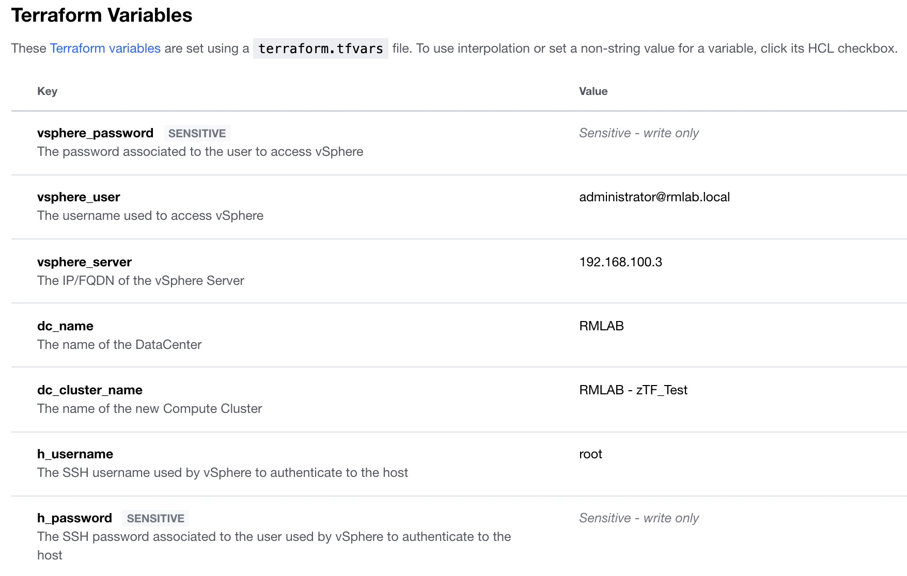
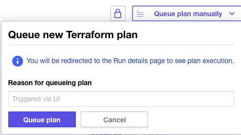
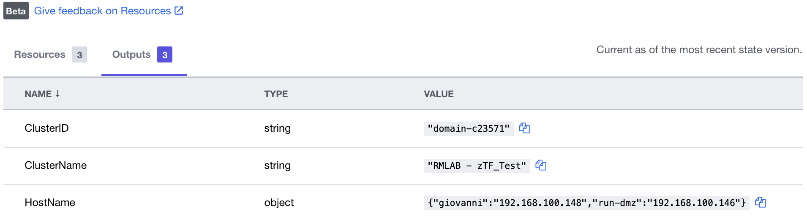

# Create a new VMware Compute Cluster and attach a single or list of server(s) 
## Overview

Cisco Intersight Service for HashiCorp Terraform (IST) addresses the challenge of securely connecting and configuring on-premises and hybrid environments to work with Terraform Cloud Business Tier. Leveraging Intersight Assist, users can integrate Terraform Cloud Business with Cisco Intersight, enabling secure communication between on-premises data centers and edge locations with the IaC platform. This means users can spend less time managing the end-to-end lifecycle of Terraform Cloud Agents, benefiting from native integration directly within Intersight, including upgrades and the ability to scale as demand grows.

In this example, we cover a simple use case to create a new compute cluster in existing data center and assign a new host (or a list of groups) to the given cluster. This use case will walk the user thought the following steps:
1.	Adding your Terraform Cloud for Business Tier Credentials
2.	Adding your Terraform Cloud Agent
3.	Executing Terraform Code to create 

The list of host is passed as a Map like in the example below:

```
servers = {
  host1 = {
    hostname            = "192.168.100.146"
    license             = "LICENSE_KEY_HER"
    thumbprint          = "AA:BB:CC:CC:DD:EE:A1:A2:A3:A4:B1:B2:B3:B4:12:34:56:1D:1E:EE"
    maintenance_mode    = true
  }
  host2 = {
    hostname            = "192.168.100.8"
    license             = "LICENSE_KEY_HER"
    thumbprint          = "FF:BB:CC:CC:DD:EE:A1:A2:A3:A4:B1:B2:B3:B4:12:34:56:1D:1E:FF"
    maintenance_mode    = false
  }
}
```

## Requirements

1.	Intersight SaaS platform account with Advantage licenses
2.	An Intersight Assist appliance that is connected to your Intersight environment
3.	Terraform Cloud Business Tier Account
4.  An exhisting DataCenter
5.	vCenter Server Access: username, password and host
6.	GitHub account to host your Terraform code
7.  A workspace in Terraform Cloud 
8.  A valid license(s) key that will be applied to the hosts


## Steps to Deploy Use Case


### Setup Terraform Cloud Business Tier Account

To add your Terraform Cloud credentials in Intersight you will need the following:
1. Terraform Cloud Username
2. Terraform Cloud API Token
3. Terraform Cloud Organization

Login to Intersight and claim your Terraform Cloud target.

### Claim Terraform Agent

Once the target is created, the agent can be added assist. 

### Create GitHub Repo

1. Go to https://github.com/CiscoDevNet/ist-vmware-compute-cluster
2. Fork it into your own GitHub account

### Create Workspace in Terraform Cloud

1. Create a new workspace and choose a version control provider (setup in the previous step) that hosts the Terraform configuration for this workspace. 
2. Go to the Variables section and add the following variables with the value specific to your environment (the values provided below are examples)

| Key                |   Value          | Type         | 
|--------------------|------------------|--------------|
| vsphere_server | 192.168.x.x|String| 
| vsphere_user | administrator@vsphere.local|String |
| vsphere_password | ******** | String, Sensitive |
| datacenter | RMLAB | String|
| dc_cluster_name | RMLAB - zTF_Test |String|
| h_username | root | String|
| h_password | ******* | String, Sensitive |


 

### Input Requirements 
```
servers = {
  host1 = {
    hostname            = "192.168.100.146"
    license             = "LICENSE_KEY_HER"
    thumbprint          = "AA:BB:CC:CC:DD:EE:A1:A2:A3:A4:B1:B2:B3:B4:12:34:56:1D:1E:EE"
    maintenance_mode    = true
  }
  host2 = {
    hostname            = "192.168.100.8"
    license             = "LICENSE_KEY_HER"
    thumbprint          = "FF:BB:CC:CC:DD:EE:A1:A2:A3:A4:B1:B2:B3:B4:12:34:56:1D:1E:FF"
    maintenance_mode    = false
  }
}
```
### Execute Deployment

To execute the Terraform code in your datacenter click on the ***Queue Plan Manually*** button





## Results

You will see one new compute cluster created and an host as part of thre cluster 
The following output will be generated:
   

## Related Sandbox

Get hands on experience with Intersight Service for Terraform in DevNet's Sandbox environment.

[Cisco Intersight Service for HashiCorp Terraform](https://devnetsandbox.cisco.com/RM/Diagram/Index/055e2dce-fdfd-4d26-a112-72b884ddd7c7?diagramType=Topology)

## Links to DevNet Learning Labs

Learn how to provision virtual machines in vSphere using Intersight Service for Terraform.

[Introduction to Intersight Service for Hashicorp Terraform](https://developer.cisco.com/learning/lab/intersight-01-ist-introduction/step/1)
[Provisioning VMs using Intersight Terraform Service for Hashicorp](https://developer.cisco.com/learning/lab/intersight-02-ist-vm-automation/step/1)